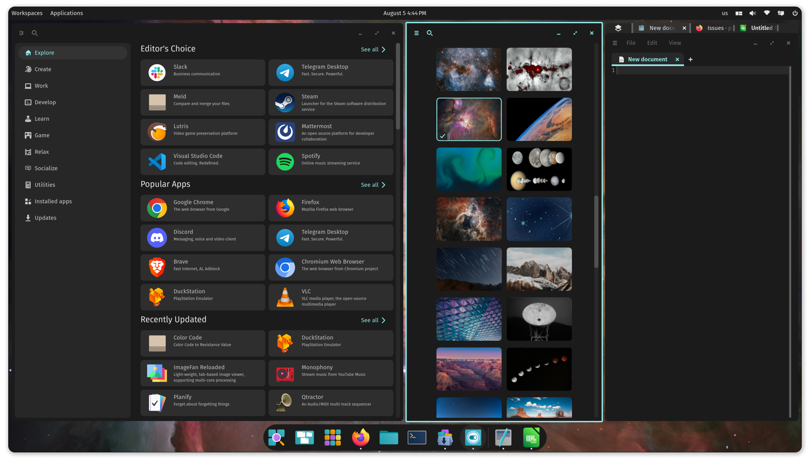

# What is Linux?
The terminology around Linux can be a bit confusing. You may have come across Linux, GNU/Linux, Linux distribution, Linux OS, etc. This chapter will try to clear things up.

# Kernel

> The Linux kernel is the core component of the Linux operating system, responsible for managing hardware resources and enabling communication between hardware and software. It handles tasks like process management, memory management, and device control, serving as the foundation for all Linux-based systems.[^1]

Linus Torvalds wrote the first version of the Linux kernel. The name 'linux' came from the directory used on the server to distribute the source code.[^2]

Incidentally, CSC hosts the server https://nic.funet.fi [^3] that made the first kernel available to the world.

Later versions of the kernel can be found at [https://www.kernel.org/](https://www.kernel.org/).

## Exercises

1. Visit the original source of the Linux kernel at https://nic.funet.fi/pub/OS/Linux.
2. Check out your Linux's installed kernel version from command line with command `uname -r`
3. Go to https://www.kernel.org and compare the version number of your Linux kernel with the versions listed on the website. Think of reasons why your kernel version might be different from the latest kernel version.
4. :cactus: See the kernel documentation at https://docs.kernel.org/index.html. :cactus:

# Operating System

> The Linux operating system consists of the kernel and software that complements the kernel. The first such software came from Richard Stallman's GNU project[^4]. Other complementary software sources have emerged since then.

> [!NOTE]
> For this reason, you may sometimes see the Linux operating system referred to as `GNU/Linux`.

## Exercises

1. Check out the GNU software available at the time it was combined (not an exact date) with the Linux kernel: [GNU's Bulletin, vol. 1 no. 11, June, 1991](https://www.gnu.org/bulletins/bull11.html#SEC16)
2. Read what Linus wrote about the release of Linux 0.01 [pdf](https://github.com/oldlinux-web/oldlinux-files/blob/master/Linux-0.01/docs/Linux.pdf). What was the name of the GNU kernel?
3. :cactus: Download, extract and check out the 0.01 version of the [Linux kernel source code](https://github.com/oldlinux-web/oldlinux-files/tree/master/Linux-0.01/sources/system/kernel). What timestamps did the source code files have? :cactus:

# (Commercial) Distribution

> A Linux distribution (distro) is a packaged version of the Linux operating system. It extends the Linux operating system with additional software, tools, utilities, and many times, custom branding. Distributions are tailored for different purposes, such as desktop use, servers, or embedded systems. Some examples of longest living distributions[^5] include [Debian](https://www.debian.org/), [Red Hat](https://www.redhat.com/en), and [Slackware](http://www.slackware.com/).

There are around nine hundred different Linux distributions, of which about 250 are active[^6]. These are the ones listed on the distrowatch.com site, in reality both numbers are probably higher.

> [!TIP]
> So when people talk about Linux, they usually mean some of the Linux distributions.

## Exercises

1. The following link will take you to the website of a random Linux distribution: https://distrowatch.com/random.php. Have a look at five random Linux distributions.
2. Check a few more random distributions. This time pay attention to the `Based on` tag in the distribution info box.
3. Now look again at the timeline of Linux distributions[^5]. Follow the different distributions back to their parent distributions. How many are there? Look at the home page or info page of the parent distribution on distrowatch.com.
4. :cactus: Install and use an upstream distribution or derivative of Debian (perhaps Ubuntu or Mint) and Red Hat (e.g. Fedora). :cactus:

> [!TIP]
> For the fourth optional exercise, you can use the distrowatch.com [search](https://distrowatch.com/search.php) page and its **'Based on'** query parameter.

# Community

> The Linux community refers to the global network of developers, users, and organizations collaborating to develop, maintain, and promote Linux and its ecosystem. It includes contributors to the Linux kernel, distributions, and open-source projects - fostering innovation and support through forums, mailing lists, and events.

## Exercises

1. Some communities are well organised. Visit the [Debian Community page](https://www.debian.org/intro/index#community)
2. Some communities are 'just' discussion forums. Visit the [Gentoo discussion forums](https://forums.gentoo.org/)
3. Some communities are built around the commercial nature of distribution. Visit the [Red Hat Community](https://access.redhat.com/community/) pages.
4. :cactus: Some communities need to have rules to function properly. Visit the [documentation pages for the Linux kernel development community](https://www.kernel.org/doc/html/v4.14/process/index.html). :cactus:

> [!IMPORTANT]
> Remember that most members of any community volunteer their time and new members should act accordingly.

# Evolution of Linux

> Peter H. Salus sums up the Unix philosophy: Write programs that do one thing and do it well. Write programs to work together. Write programs to handle text streams, because that is a universal interface.
> The GNU operating system is a complete free software system that is upwardly compatible with Unix. GNU stands for "GNU's Not Unix".
> The Linux kernel is a Unix-like operating system kernel.

## Exercises

1. Read the Wikipedia article on [Unix philosophy](https://en.wikipedia.org/wiki/Unix_philosophy).
2. Read about the [GNU project by Richard Stallman](https://www.gnu.org/gnu/thegnuproject.html).
3. Read the Wikipedia article on [Unix-like](https://en.wikipedia.org/wiki/Unix-like).

# What Linux is not?

_Pop!\_OS COSMIC desktop environment_

Modern Linux distributions can be very pleasing to the eye, easy and efficient to use, free and privacy-preserving.

## Exercises

1. Read the Wikipedia article on [POSIX](https://en.wikipedia.org/wiki/POSIX).

[^1]: [kernel.org](https://www.kernel.org/)
[^2]: [Wikipedia - History of Linux](https://en.wikipedia.org/wiki/History_of_Linux#Naming)
[^3]: [LINUX's History](https://www.cs.cmu.edu/~awb/linux.history.html)
[^4]: [Overview of the GNU System](https://www.gnu.org/gnu/gnu-history.en.html)
[^5]: [Wikipedia - Linux Distribution Timeline](https://upload.wikimedia.org/wikipedia/commons/1/1b/Linux_Distribution_Timeline.svg)
[^6]: [distrowatch.com search](https://distrowatch.com/search.php)
