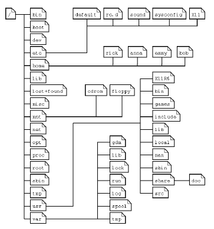
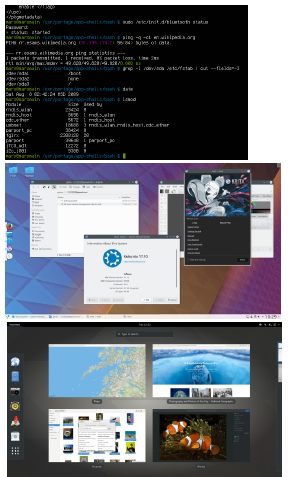

---
title:	What is UNIX/Linux?
author:	CSC Training
date:	  2020-04
lang:	  en
---
# Contents of this session

This session shall give you some insight on:

- the history of UNIX and Linux
- the distinguishing features between UNIX and Linux
- the determining features of LINUX (which are common with UNIX)
- the concept of Command Line and Graphical User Interfaces

# Linux  ≠ UNIX®

- Linux is a free and open-source software operating system built around the Linux kernel.  
   - The kernel is a computer program that is the core of a computer's operating
system, with complete control over everything in the system.
- Linux was originally developed for personal computers based on
the Intel x86 architecture, but has since been ported to
more platforms than any other operating system.
- Linux is a derivative of the original AT&T Unix operating system.
- The Linux kernel is an Unix-like operating system kernel.

# The “Unix philosophy”

- Unix was designed to be portable, multi-tasking and multi-user in a time-sharing configuration.
- Unix (and thus, unix-like) systems are characterized by various
concepts:
   - the use of plain text for storing data;
   - a hierarchical file system;
   - treating devices as files;
   - the use of a large number of small programs that can be strung together through a command-line interpreter, as opposed to using a single monolithic program that includes all of the same functionality.

# Multitasking
- Multitasking is the concurrent execution of multiple tasks (also known as processes) over a certain period of time.
    - As a result, a computer executes segments of multiple tasks in an interleaved manner.
- Multitasking automatically interrupts the running program, saving its state (partial results, memory contents and computer register contents) and loading the saved state of another program and transferring control to it.
    - This is called context switching.
  

# Multi-user

- Multi-user system is operating system software that allows access
by multiple users of a computer, typically simultaneously.
- The operating system provides isolation of each user's processes
from other users, while enabling them to execute concurrently.
- The filesystem supports multiple users by providing permissions
or access rights to specific users and groups for all the files stored
on the system.

# Filesystem
- Unix-like operating systems create a virtual file  system,
which makes all the files on all the devices appear to
exist in a single hierarchy. This means there is one root
directory, and every file existing on the system is
located under it somewhere.
    - To gain access to files on another device, the operating system
must be informed where in the directory tree those files should
appear. This process is called mounting a file system.
- Linux supports numerous file system formats, most
common ones being ext* family (ext2, ext3 and ext4),
XFS, ReiserFS and btrfs.

# Linux Distributions

- A Linux distribution (often abbreviated as distro) is an operating system made from a software collection, which is based upon the Linux kernel and, often, a package management system.
- A typically comprises of a Linux kernel, GNU tools and libraries, additional software, documentation, and a desktop environment.
    - Almost 600 Linux distributions exist (500 in  active development).
    - Debian (Ubuntu, Mint, Knoppix) and Red Hat (Fedora, RHEL, CentOS) are
the most common ones.
    - Whether Google's Android counts as a Linux distribution is a matter of
definition.
  - selection of different distributions [(http://www.distrowatch.org/)](http://www.distrowatch.org/)

# User Interfaces: CLI and GUI

 - **Command-line interfaces** (CLI) shells, are  text-based user
interfaces, which use text for both input and output.
    - The dominant shell used in Linux is the Bourne-Again Shell (bash).
    - Most low-level Linux components use the CLI exclusively.
    - The CLI is particularly suited for automation of repetitive or delayed tasks, and provides very simple inter-process communication.

# User Interfaces: CLI and GUI

- On desktop systems, **graphical user interfaces**  (GUIs), are the most common ones providing extensive desktop environments.
    - Typical ones are the K Desktop Environment (KDE), GNOME, MATE, Cinnamon, Unity, LXDE, Pantheon and Xfce, though a variety of additional user interfaces exist.
