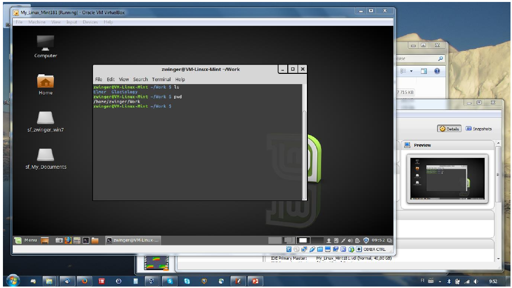
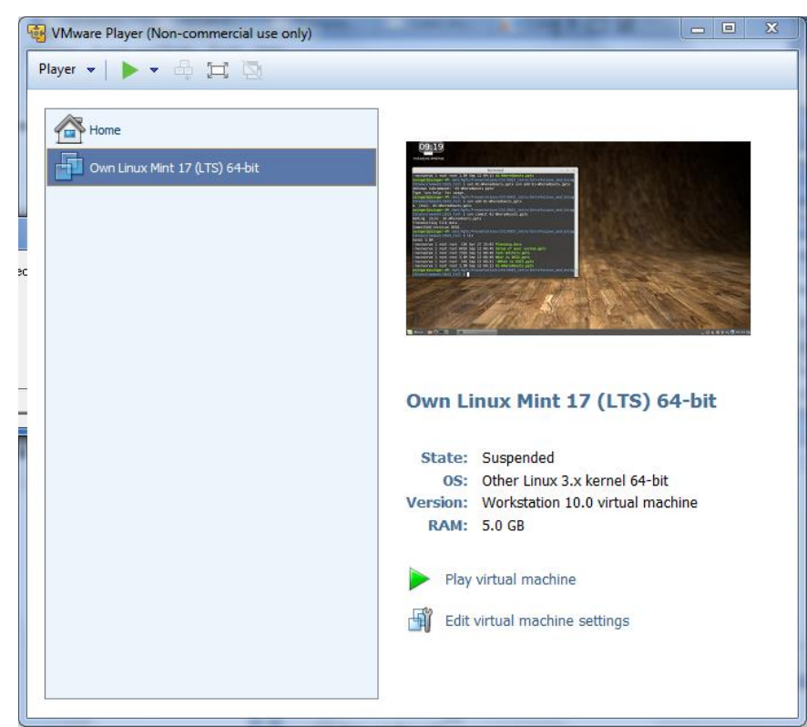
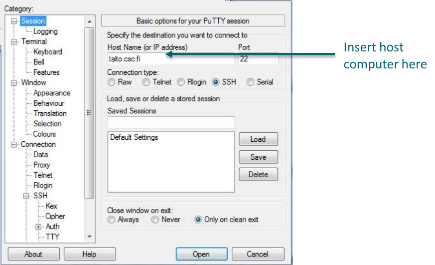
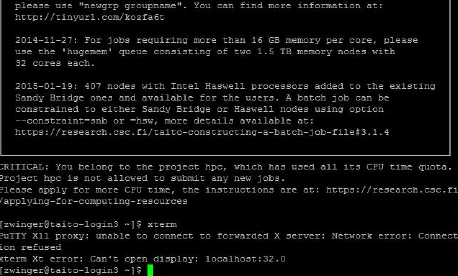
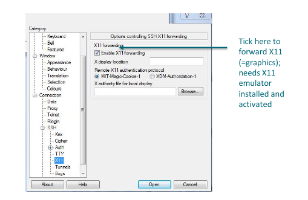

---
title:	Linux on my own computer
author:	CSC Training
date:	  2020-04
lang:	  en
---
# Contents of this session

This session shall give you some insight on:

- the different option to use Linux on or from your own computer
- introduce the concepts of dual boot, remote access and virtual machine 
- give you information on how to connect to UNIX/Linux from Windows

# Running your own Linux system

- Basically, four options:
	1. Run **native Linux** on your computer
	- Includes the option of dual boot (two OS’s side-by-side, but optionally booting into one of them)
	- Not recommended: run as live-system (boot from USB/CD)
	2. Run it inside a **Virtual Machine**
	- the method of choice in this course (see later)
	3. Run in a **container**
	- containers are environments that still use the host-system's kernel (e.g. Docker, Singularity)
	- containers bring along all needed libraries 
	4. Run it **remotely** over the network
	- Includes remote login and remote desktops
	- Naturally, needs a network connection

# Native Linux

- One can nowadays buy Linux pre-installed laptops and desktops
- Or format the hard-drive and install Linux
- Or install Linux alongside, i.e., **Dual Boot**:
	- Boot loader in the beginning gives choice of which OS to load
	
	"+" Pros:
	  - native Linux works faster and all resources of the computer are dedicated to a single OS
	  - Windows file-system can be mounted in Linux
	
	"-" Cons:
	  - changing between OS’s needs reboot of machine
	  - Mounting of Linux/Unix file-systems on Windows at least problematic

# Dual Boot

- Q: *I have a Windows machine, what do I have to do to install Linux in parallel (as dual boot) to it?*
  1. Provide a separate disk(-partition) on computer
	- It is possible (e.g., in Ubuntu) to install into existing Windows system, but you loose performance
	- Only one hard-drive? Some installation media allow for live-mode (Linux running from USB/CD) and have a re-partitioning program within (always backup your data!)
  2. Download the image of your favorite Linux distribution (see later)
  3. Installation generally guides you also through boot-loader configuration
  
# Native UNIX: Mac OSX = UNIX + bling

- The underlying system to a Mac 
is [Darwin](https://developer.apple.com/library/archive/documentation/MacOSX/Conceptual/OSX_Technology_Overview/SystemTechnology/SystemTechnology.html), which kernel is a fork from [BSD](https://www.freebsd.org/) and hence is a UNIX
	- Darwin is actually open-source
	- The rest of MacOS apparently not
- The terminal of a Mac is a POSIX CLI
	- the default shell for a long time in Mac was bash
	- latest update ([Catalina](https://www.apple.com/macos/catalina/https://www.apple.com/macos/catalina/)) changed to zsh 
- One can even display UNIX-type (X11) graphics (see later)

# Containers

- The de-facto standard container application is 
- Containers are explained in more details on [this page provided by Docker](https://www.docker.com/resources/what-container)
- Docker runs on any common operating system (Windows, MacOS, Linux)
- Basically only without graphics
	- It is for instance possible to run a remote desktop inside *Docker* and connect to it, but its setup is not fun

# Virtual machines

- Running an application inside your native OS that emulates hardware on
which you can install another OS (in fact, any you want)
- "+" Pros:    
	- Seamless integration of Linux (guest) in host system  
	- Data exchange between guest and host
	- Suspend system (no new boot, leave applications open)
	- Backup and portability (copy to new computer)
- "-" Cons:
    - Performance loss of guest system (SW layer between emulated and real hardware)
    - Shared resources between guest and host

# Virtual machines

- The machine can be 
suspended as is
- Upon relaunch, the user gets
the system as she/he left it

# Virtual machines
- Q: *I have a Windows computer. How can I install Linux running in a Virtual
Machine (VM)?*
	1. Make sure you have the hardware to support a VM (CPU, memory > 2GB, disk-space)
Some older CPUs do not support virtualization
	2. Download a VM software (see next slide) and install it
	3. Download an image of your favorite Linux distribution (see later)
	4. Mount (=include) the medium in your VM and install as if it would be a normal computer
	5. Instead of 3+4: Download a ready made virtual appliance (~virtual computer system)
	- be sure to download only from trusted sources!

# Virtual machines

Two main vendors for VM packages:

- [VMware (TM) Player](https://www.vmware.com/fi/products/workstation-player.html) (commercial)
	- [Restricted](https://www.vmware.com/company/labs-academic-software/academic-licensing-overview.html) to non-commercial use 
- Oracle (former Sun) [VirtualBox](https://www.virtualbox.org/) (open-source)
	- Supports even VMWare virtual disks
- Usually, additional tools (e.g. Vmware-tools) have to be installed
	- Important to know the hardware (CPU-type)
- Might need adjustments in BIOS (virtualization)
- Virtual Appliances: Google or FUNET
	- Only download appliances you trust!

# Remote connection

- From Max OS X:
	- ssh and X11 (graphics) built in - like from a Linux machine
-  From Windows ® :
	- Needs a ssh client: e.g. [PuTTY](http://www.chiark.greenend.org.uk/~sgtatham/putty/)
	- If graphics, needs a X11-emulator: e.g. [Xming](http://sourceforge.net/projects/xming/)
- Remote desktops:
	- Needs a server running (and network connection)
	- Certain software (client + server)
	- CSC is maintaining such a service (NoMachine) - see CSC [documentation](https://docs.csc.fi/apps/nomachine/)
	
# Remote connection from Windows ® using PuTTY

- Initialization of the connection 
- Session can be saved (remembers settings next time)
- Usually `Port 22` is default for ssh on host

# Remote connection from Windows ® using PuTTY

- Upon pressing **Open** the connection   will be established
- a simple terminal opens
- by default no graphics forwarding

# Remote connection from Windows ® using PuTTY

- If X11 emulator (e.g., PuTTY) is installed   graphics can be forwarded to Windows ®
- Needs special setting in PuTTY (see picture)

