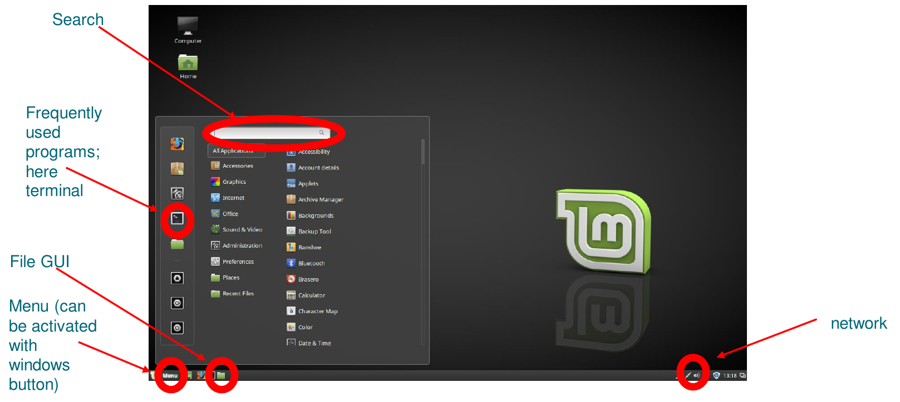
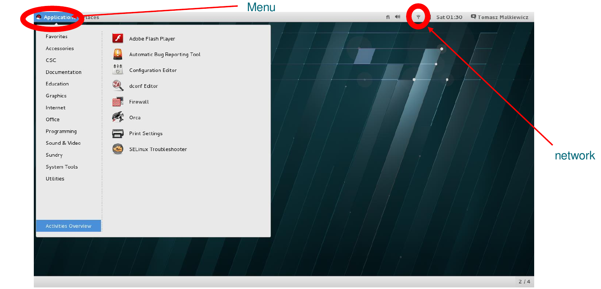
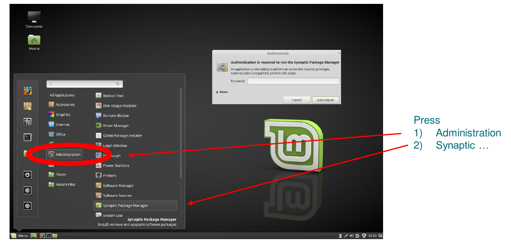
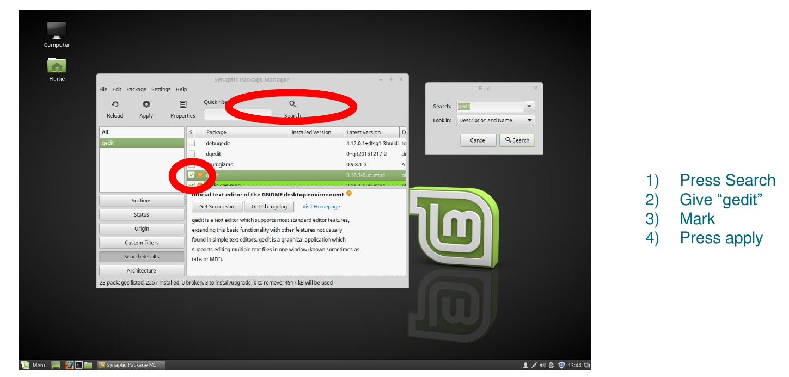

---
title:	First use of Linux
author:	CSC Training
date:	  2020-04
lang:	  en
---

# Starting

In this short session we will explore our virtual machine and work over the following points:

- how to open the terminal
- how to troubleshoot issues with network (if there are)
- how to find basic programs from the GUI, such as  web browser
-  Install new software:
	- Text editor, e.g., gedit, nano
	- write something, like, e.g., notes on this session

# Linux Mint

# RHEL

# Installation of software packages

# Installation of software packages

