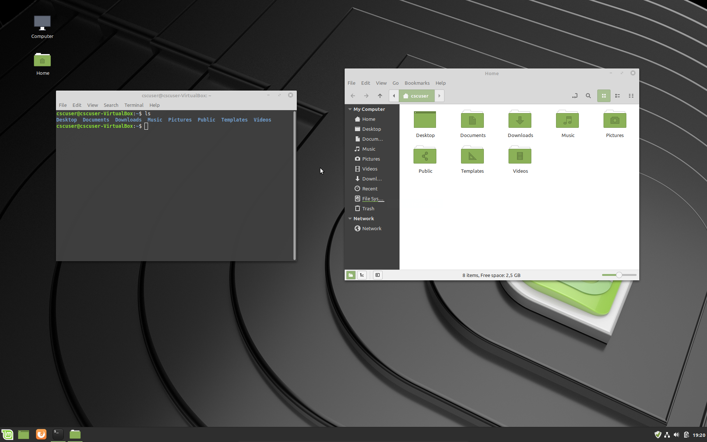

---
title:	A first glimpse of the shell
author:	CSC Training
date:	  2020-04
lang:	  en
---
# Contents of this session

This session shall give you some insight on:

- What is a shell?
- What is a command?
- Basic introduction how to navigate and change the filesystem from the shell
- Following shell commands will be discussed **`ls`, `cd`, `pwd`, `cat`, `less`, `mkdir`, `rmdir`**

# What is a shell?

- _A shell in computing provides a user interface for access to an operating system’s kernel services._ (Wikipedia)
- Remote login:
    - Often no GUI (Graphical User Interface) available
- Shell: runs in terminal with a set of commands
- Different flavours:
    - bash (default), tcsh (old default), zsh, corn-shell, ...

# What is a shell?

Lets open the a **terminal** and the **desktop GUI**


# What is a command?

- A command is a small program provided by the shell
- The over-all structure of a command is:
command -option [optional input]
- Example (listing of a directory, we will see details later)
```bash 
$ ls –lsh /etc/init.d
```
    - MIND: **`$`** depicts the shell's _command prompt_ (is not part of the command) 
- Are commands **case sensitive**? Try: `$ Ls –lsh /etc/init.d`
- How to **find a command**? `$ apropos list`
- How to **find** all **options** for a command? $ `$ man ls`

# Listing of directories and files

Print contents of a directory or information on a file

- Detailed list of directory (in this case `/etc`):
```bash 
$ ls -lhtr /etc/
```
- the options are:
    - `-l` displays additional information (detailed list in GUI)
    - `-h` displays size in human readable format (in particular file-sizes)
    - `-t` orders by date (use `-r` to reverse order, i.e., oldest first)
    - `-d` omit listings of sub-directories (not used above)
   
# Listing of directories and files: Wildcards

- Only print directory/filenames matching a  expression:
```bash
$ ls -d /etc/*.d
```
   - **`*`** is a wildcard for any *combination* of alpha-numeric characters
- Only print directory/filenames with a 4 char suffix:
```bash
$ ls –l /etc/*.????
```
   - **`?`** is a wildcard for any *single* alpha-numeric character

# Contents of a file

- Printing contents of (text) file to screen:
```bash
$ cat /etc/group
```
	- **`-n`** to precede lines with line numbers
	- What if the file does not fit on the screen?
- Open a scroll-/pageable view of a file:
```bash
$ less /etc/group
```
	- Press **`q`** to quit
	- **`/`** to search forward, **`?`** for backwards
	- **`n`** to find the next match, **`N`** for previous

# Moving around in directories
- change directory:
```bash
$ cd /etc/
```
- print work directory:
```bash
$ pwd 
 -> /etc
```
	- NB: output in shell is indicated by `->`
- go to subdirectory:
```bash
$ cd init.d
$ pwd
 -> /etc/init.d
```
	- the above is the same as using relative path: `$cd ./init.d`

# Moving around in directories
- **Relative paths:**
- a single dot **`.`** indicates the local directory
- double dots **`..`** indicate the directory above
	- in last slide it was mentioned that one can use (relative path)
```bash
$ cd ./init.d
```
   - our current directory is `/etc/init.d`
- to go back to `/etc` one can either use the relative path:
```bash
$ cd ..
```
    - mind the space between `cd` and `..` or `.`
	
# Moving around in directories
- **Absolute paths:** 
   - always starting with a leading `/` (indication root-directory)
```bash
$ cd /etc/init.d
```
	- brings you there from everywhere in the file-system
- **Combination of relative paths**:
```bash
$ cd ../../usr
```
	- brings you from `/etc/init.d` to `/usr` (check with `pwd`)
- **The way home:**
```bash
$ cd ~/
```
	- brings you into home-directory (alternatively, just `cd`)

# Creating directories

- Make a new directory 
```bash
$ mkdir mydir1
```
	- make first sure you are in your home-directory: `cd ~/`
- Create a sub-directory relative to *existing* path:
```bash
$ mkdir mydir1/subdir1
```
- Recursively (whole sub-tree in one):
```bash
$ mkdir -p mydir2/subdir2
```
	- try first without `-p` option; What happens?
	
# Renaming/moving directories	

- The command **`mv`** does both, renaming and moving directories:
- To **rename** `mydir2` into `mydir3`
```bash
$ ls
 -> mydir1 mydir2
$ mv mydir2 mydir3
$ ls
 -> mydir1 mydir3
```
- **Mind**: renaming `mydir2` works only if `mydir3` does not exist!
- Exactly the same strategy presented above applies also to renaming of regular files

# Renaming/moving directories
- To **move** a directory into another directory, naturally, the **destination has to already exist**
```bash
$ mkdir subdir3
$ ls
 ->  mydir1 mydir3 subdir3
$ mv subdir3 mydir3
$ ls
 ->  mydir1 mydir3
$ ls mydir3
 ->  subdir2  subdir3
```

# Removing directories

- The command **`rmdir`** only **removes empty directories**
```bash
$ cd mydir1
$ rmdir subdir1
$ cd ..
$ rmdir mydir1
$ ls
 -> mydir2
```
- Try to remove whole branch of empty directory tree 
```bash
$ rmdir mydir3
 -> rmdir: failed to remove 'mydir3/': Directory not empty
```
	- **Exercise**:  Why is there an error message like the one above? 

# Recursively removing directory trees

- use `-p` option to recursively remove **empty** (!!) directory trees
```bash
$ rmdir -p mydir3/subdir?
 -> rmdir: failed to remove 'mydir3/': Directory not empty
$ ls mydir3
 -> ls: cannot access 'mydir3': No such file or directory
```
	- **Exercise**: Explain why, despite the error message, `mydir3` is gone.
	
# Creating files, redirecting output

- In UNIX/Linux: **everything is text**
	- even directories are only special text-files (containing a list of filenames)
	- Also the output of commands is text
- Output can be **redirected** into files using the symbol **`>`** or **`>>`**
- In case of creating a new file **creating new file**:
```bash
$ echo "hello world" > myfile1.txt
```
	- MIND: An existing file with that name will be overwritten
	- to prevent that from happen, set (use `+o` to revert)
	```bash
	$ set -o noclobber
	```
- **Exercise**: Show contents of `myfile1.txt` on screen

# Creating files, redirecting output

- In case of creating a new file **appending a file**:
```bash
$ echo "hello again" >> myfile1.txt
```
	- appends to an existing file
	- creates a new one, if file does not exist	
- create an **empty file**:
```bash
$ touch myfile1.txt
``` 
	- If `myfile1.txt` exists, only its access date will be altered
	- Remark: suffixes (like here `.txt`) are not really important in Linux, but useful for the user. They can have an impact on what actions the desktop GUI takes (e.g., opening PDF's with a PDF reader)

# Copying files

- Make a copy of a file
```bash
$ cp myfile1.txt myfile2.txt
```
	- MIND: If no special precausions are taken, an already existing destination `myfile2.txt` would be overwritten
	- one can play save by providing the option `-i`
	- this option will ask before overwriting exsiting files
	
# Copying directories	

- Recursively copying a directory
```bash
$ mkdir -p mydir4/subdir4
$ ls -d mydir?
  -> mydir4
$ cp -r mydir4 mydir5
$  ls -d mydir?
  -> mydir4 mydir5
```
- **Exercise**: Create another directory `mydir6` and try the following commands:
```bash
$ cp myfile2.txt mydir5
$ cp -r mydir5 mydir6
```
	- What will be the contents of the directory `mydir6`?

# Renaming/moving files

- Like for directories, the command `mv` has different results:
    1. destination does not exist (**renaming**)
	```bash
	$ ls myfile?.txt
	  -> myfile1.txt myfile2.txt
	$ mv myfile2.txt myfile3.txt
	$ ls
      -> myfile1.txt myfile3.txt
	```
	2. destination exists and is a file (**overwrite**)
	```bash
	$ mv -i myfile1.txt myfile3.txt
      -> mv: overwrite 'myfile3.txt'? n
	``` 
	3. destination exists and is a directory (**moving**)
	```bash
	$ mv -i  myfile3.txt mydir5
	$ ls myfile?.txt
      -> myfile1.txt
	```

# Renaming/moving files
- **Exercises**:
	- Create another empty file `myfile4.txt`
	- Make a listing (`ls`) to verify that it exists
	- Come up with a single command that moves `myfile4.txt` and renames it at the same time into `myfile5.txt` 
	- As result, show the listing of `mydir5`


# Removing files

- Removing a file (again with playing save with `-i` option)
```bash
$ rm -i  myfile1.txt
  -> rm: remove regular file ' myfile1.txt'?  y
$ ls myfile1.txt
  -> ls: cannot access 'myfile1.txt': No such file or directory
```
    - MIND: There is no such thing as a _trashbin_ in Linux. Once a file is gone, it usually is gone for good!
	
# Recursively removing (non empty) directories 

- Removing recursively a whole directory tree
```bash
  $ rm -r mydir5
```
    - the option `-f` would force to recursively remove the whole tree behind the directory
    - MIND: `rm -f -r ` is a very dangerous command and you should execute it with care (and you always should have a backup of your important files)
