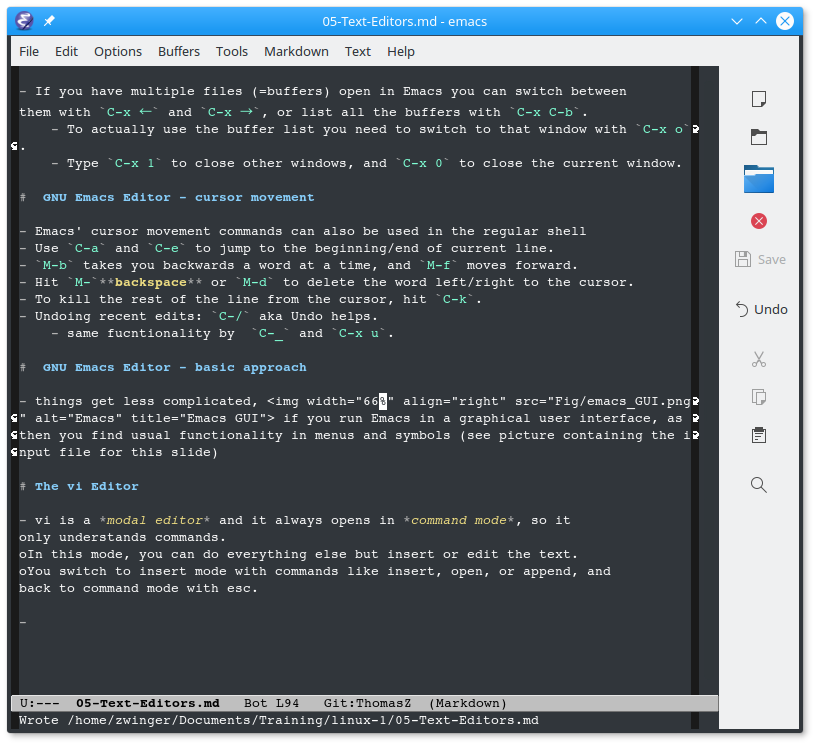

# Contents of this session

This session shall introduce you to the basics of the following UNIX/Linux text editors

1. nano
2. emacs
3. vi

# Why text editors?

- Several times in this course you encountered the phrase "_everything is text_".  Consequently, it is important to create and manipulate text in files
- We discuss standard (shell) text editors you most likely can expect to be found on Linux computers by default
	- some applications use these text editors as defaults (e.g. `git` on Ubuntu calls `nano` for writing commit messages)
	
# Why text editors?
	
- For users being used to editors or text processing programs from Mac or Windows, these editors may not immedeately feel intuitive
	- Alternatively, there are editors in Linux desktop GUIs that are closer to Windows way of usage, e.g., gedit or Kate
    - for instance, gedit supports **ctrl+c** (copying), **ctrl+x** (cut) and **ctrl+v** (Paste)
	- No rules here: use, what suits you best
	
# Nano — a basic editor for terminal

- For opening and creating files, type:
  ```bash
  $ nano filename
  ```
  - dissable wrapping of long lines with `-w` (e.g. in config files):
  ```bash
  $ nano -w /etc/fstab
  ```
- If you want to **save** the changes you made, press **ctrl+o** (`^O`)
  - NB: this combination is denoted using the carrot symbol **`^`** to stand for **ctrl** 
- To **exit** nano, type **ctrl+x** (`^X`).
  - In case of unsaved modifications, nano will ask you if you want to save it. Answer either  **n** (no)  or **y** (yes) and in case provide filename

# Nano — a basic editor for terminal

- **Editing** with nano:
	- cutting single line: **ctrl+k** (`^K`) 
	- pasting cutted line: **ctrl+u** (`^U`)
	- placing marker: **ctrl+6** (`^6`), then move cursor forward and hit `^K` to cut text under highlighted region
- **Searching** with nano:
	- search is activated with **ctrl+w** (`^W`); then type in string followed by **Enter**
	- reoccuring instances of same string can be found with **alt+w** (`M-W`) 
	  - `M-` stands for meta-key, usally the **alt** key

# GNU Emacs Editor

- Emacs = Editor MACroS for TECO 
- For opening and creating files, type:
  ```bash
  $ emacs filename
  ```
  - Emacs will detect whether you are working on a GUI and opens in a separate window if you are. To disregard the GUI (nw = no window):
  ```bash
  $ emacs -nw filename
  ```
- In Emacs, `C-` denotes the **ctrl** key, `M-` the meta (usually **alt**) key.	

# GNU Emacs Editor
- If you want to **save** the changes,  press **ctrl+x**,**ctrl-s** (`C-x C-s`)
	
-  To **open** a file from within Emacs press **ctrl+x**,**ctrl-f** (`C-x C-f`).
	- A new file will be created if it does not exist yet.
- To **exit** Emacs, type **ctrl+x**,**ctrl-c** (`C-x C-c`) .
	- Upon exiting Emacs with a modified file open, it will ask you if you want to save it. Answer with `y` if you want, else with `n`
- You can abort any command by hitting `C-g`.

# GNU Emacs Editor - windows


- If you have multiple files (=buffers) open in Emacs you can switch between
them with `C-x ←` and `C-x →`, or list all the buffers with `C-x C-b`.
	- To actually use the buffer list you need to switch to it with `C-x o`.
	- Type `C-x 1` to close other, and `C-x 0` to close the current window.
	
#  GNU Emacs Editor - cursor movement

- Emacs' cursor movement commands can also be used in the regular shell
- Use `C-a` and `C-e` to jump to the beginning/end of current line.
- `M-b` takes you backwards a word at a time, and `M-f` moves forward.
- Hit `M-`**backspace** or `M-d` to delete the word left/right to the cursor.
- To kill the rest of the line from the cursor, hit `C-k`.
- Undoing recent edits: `C-/` aka Undo helps.
	- same fucntionality by  `C-_` and `C-x u`.

#  GNU Emacs Editor - basic approach
	
- things get less complicated,  if you run Emacs in a graphical user interface, as then you find usual functionality in menus and symbols (see picture containing the input file for this slide)

# The vi Editor

- vi is a **modal editor**
	- Warning: if you are used to text processing in Windows or Mac, this can be highly counter-intuitive concept
	- vi, though, is part of any Linux/UNIX system, so always there
- open a file:
  ```bash
  $ vi filename
  ```
- it always opens in **command mode**, so it only understands commands.
- You switch to **insert mode** with commands like insert (`i`), open (`o`), or append (`a`), and
back to command mode with **esc**.

# The vi Editor

- To **save** the changes, type **esc : w enter**.
- To **exit** vi, type **esc : q**
- vi will not allow you to exit from a modified file. If you really want to discard
your changes, you need to type **esc : q !**
- To save and exit on one go type **esc : w q**
