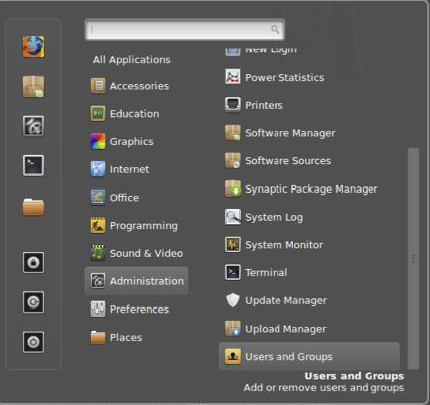
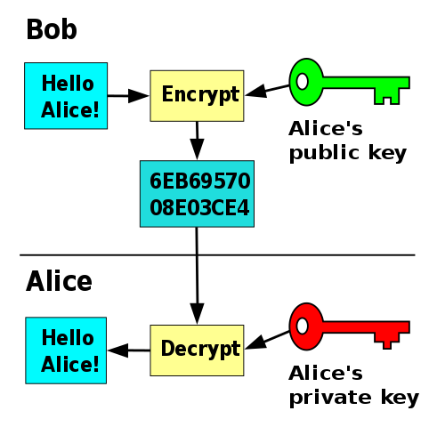

# Contents of this session

- some definition on security
- some guidlines on what to do to keep your own system save 

# Information security

- *Information security is the practice of preventing unauthorized access, use, disclosure, disruption, modification, inspection, recording or destruction of information.* (Wikipedia)
- Primary focus is the balanced 
    - protection of the confidentiality, integrity and availability of data
    - while maintaining efficiency and productivity.
- The *trinity* explained:
    - Confidentiality: don't let others access your data.
    - Integrity: don't let others modify your data.
    - Availability: make data available when it is needed.

# Do Nothing - scenario for Linux 

|                |                   |
|----------------|-------------------|
| Computer crime |  Rootkits         |
| Vulnerability  | Bootkits          |
| Eavesdropping	 | Keyloggers	     | 
| Malware		 | Screen scrapers   |
| Spyware		 | Exploits		   	 |
| Ransomware	 | Backdoors		 |
| Trojans		 | Logic bombs	   	 |
| ~~Viruses~~    | Payloads		   	 |
| Worms			 | Denial of service |

# The biggest risk

- The single most common risk for you: **loss of data**.
- It's just a matter of a small typo in a command: 
```bash
  $ rm -rf . /*
```
  - DON´T EXECUTE THE LINE ABOVE: This will delete every file and directory on the system without asking anything (if you have permissions).
- Make backups – and keep them up-to-date!

# System administration

- Do not run any unnecessary services, like www or email servers.
```bash
  $ service --status-all
```
- Enable firewall.
  - Firewall is a process that monitors and controls incoming and outgoing
network traffic.
```bash
  $ sudo ufw enable && sudo ufw default deny incoming
```
- Install patches regularly.
```bash
  $ sudo apt update && sudo apt upgrade
```
  - or use desktop udate tool, instead

# User administration

- Users can be managed from command line:
```bash 
  $ sudo useradd -m -G cdrom -c "Joe Cool" someone
  $ sudo passwd someone
```
- Most systems have an administrative    graphical user interfaces for doing
that job.
- Grant only permissions that are really needed, assign a password and make sure it's a good one.

# On passwords

- Do not use same password(s)   for different services.
-  Use password managers, e.g. KeePassX.
     - Pros: single master password to remember, cross-platform encrypted vault for all your passwords, great password generator, integration with browsers,...
     - Cons: you can loose all your passwords in one go.

# Encryption

- Encryption is the process of encoding information in such a way that only authorised parties can access it.
-  There are two common methods to encrypt your data:
  - Filesystem stacked level encryption, where files and directories are encrypted individually with tools like eCryptfs and EncFS.
  - Block device level encryption, where the whole block device (usually a disk) is encrypted using e.g. dm-crypt and LUKS 

# Example using eCryptfs

- Start with an empty directory
```bash
  $ mkdir Private
```
- Mount it using a special file-system type `ecryptfs`
```bash
  $ sudo mount -t ecryptfs Private Private
```
   - Enter a good passphrase and memorize it. There is no way getting your data back should you forget your passphrase.
   - Without further ado just accept the default settings.
   -  Anything you save in the directory Private will now be encrypted.
   - Unmount
   ```bash
   $ sudo umount Private
   ```

# SSH – The Secure Shell

- SSH offers a secure remote login (and more) over unsecure
networks.
  - Comes (almost) always by default with Linux and macOS. On a Windows
computer a 3rd party client, e.g. PuTTY, is needed.
  -  It ensures that all communication to and from the remote server happens in an encrypted manner, and is based on something called ssh keys.
- Keys eliminate the need for passwords.
  - You win twice: higher convenience and increased security!

# SSH keys

- First you need to create a key pair (unless you already have one), which are used to encrypt and decrypt data: 
```bash
  $ ssh-keygen -t rsa -b 4096
```
   - This creates two files: `.ssh/id_rsa` and `.ssh/id_rsa.pub` in your home directory.
   - The `id_rsa` is your **private key**. **Do not disclose this one!**
   - The `id_rsa.pub` is your **public key**. You may think of it as a lock, which opens only with your private key. You may place it anywhere you want; it's public.
   - You may have as many key pairs as you wish. Use option `-f keyname` to choose keypair name

# Using SSH (the hard way)

- The public key needs to be copied over to a specific file, `~/.ssh/authorized_keys`, on the remote host (server) you intend to log in with ssh:
```bash
  $ scp ~/.ssh/id_rsa.pub csctrngNN@vmXXXX.kaj.pouta.csc.fi:
  $ ssh csctrngNN@vmXXXX.kaj.pouta.csc.fi
  host $ cat id_rsa.pub >> .ssh/authorized_keys
```
   - There is an **elegant single-step command** combining all this (**next slide**)
   - The next time you log in to the remote host ssh will be using your keys instead of your password on that host.
   - NB: If you assigned a passphrase for your keys (highly recommended!) `ssh` will epeatedly ask for that passphrase. To avoid this, use `ssh-agent`.
  
# Using SSH (the elegant way)
- Instead of manually copying the private key and including it into `.ssh/authorized_keys` on the remote computer, we can use a command provided for exactly doing that
```bash
  $ ssh-copy-id -i .ssh/id_rsa csctrngNN@vmXXXX.kaj.pouta.csc.fi
```
   - Give the name of the keypair without the `.pub` suffix; the command itself will take care that only the private key is transferred
   - You will be prompted the password of the remote computer (for the last time) to execute that comman
   - Thereafter, you should be able to use the key to log in

   
   


